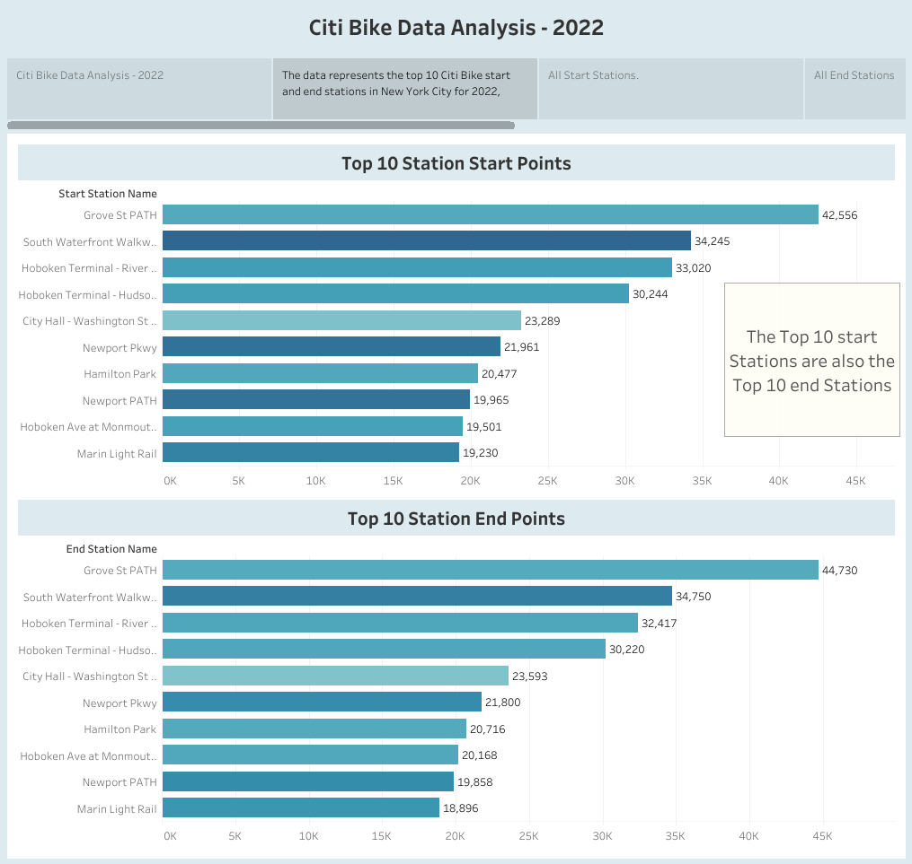

# Citi Bike Data Analysis - 2022 Data

1. 2022 Totals.

 
For the year of 2022 there were a total of 895,485 rides made by both Citi Bike members and casual riders. Total stations where rides started were 85, whereas there were 321 stations where rides came to an end. When looking closely at the End station Map there were many single stations in Manhattan where rides ended.
 

