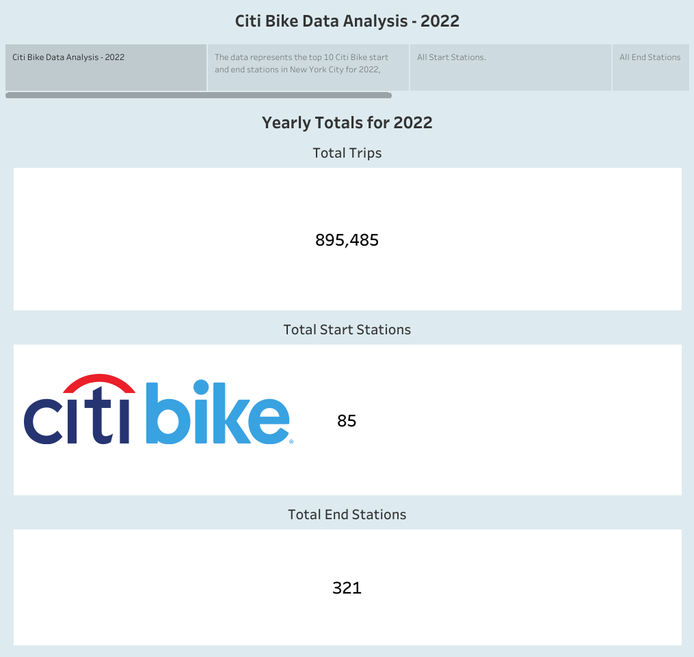

# Citi Bike Data Analysis

## Project Description

As the new lead analyst for the New York Citi Bike program, you are now responsible for overseeing the largest bike-sharing program in the United States. In your new role, you will be expected to generate regular reports for city officials looking to publicise and improve the city program.

### Requirements

* Tableau

### Instructions

Your task in this assignment is to aggregate the data found in the Citi Bike Trip History Logs and find two unexpected phenomena.

* Design 2–5 visualisations for each discovered phenomenon (4–10 total). You may work with a timespan of your choosing. Optionally, you can also merge multiple datasets from different periods.

### Visualisation
Link to my Tableau Data Visualisation https://public.tableau.com/app/profile/troy.foote/viz/Citi_Bike_Analysis_16820865662000/CitiBikeStory?publish=yes

### References
Data was chosen from the Citi Bike Data Site https://citibikenyc.com/system-data